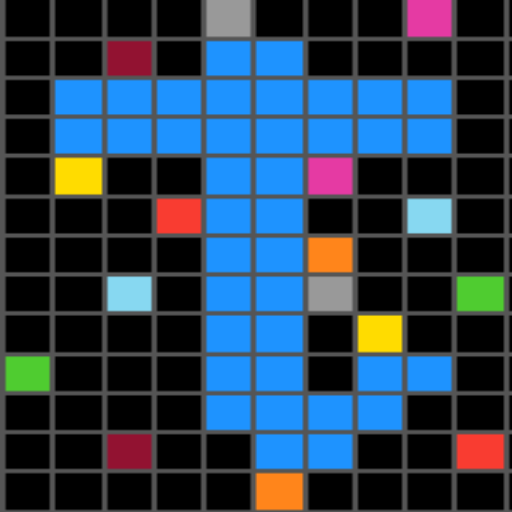

<p align="center">
  
</p>

# Tessera-ARC

> **Capturing Human Reasoning, One Piece at a Time**

A crowdsourcing platform for collecting rich human cognitive data on Abstraction and Reasoning Corpus (ARC) tasks. Tessera-ARC captures not just solutions, but the complete reasoning process—from initial perception to final strategy.

[](https://opensource.org/licenses/MIT)

---

## 🎯 Project Overview

The [Abstraction and Reasoning Corpus (ARC)](https://github.com/fchollet/ARC-AGI) is a benchmark designed to measure general fluid intelligence in AI systems. While current AI achieves ~55% accuracy, humans reach 76%+ with minimal examples.

**Tessera-ARC bridges this gap by collecting:**
- 🧠 Hierarchical perceptual observations (7 categories, 35 subcategories)
- 📝 Natural language reasoning descriptions (500-800 words per task)
- 🖱️ Complete behavioral traces (every click, resize, reset)
- ⏱️ Temporal dynamics (millisecond-level timing)
- 🎯 Metacognitive assessments (confidence, difficulty, strategy)

**Goal:** Create an open-source dataset of human reasoning to train the next generation of AI systems.

---

## ✨ Features

### For Participants
- Interactive grid editor with 10-color ARC palette
- 800 official ARC tasks (training + evaluation sets)
- Progressive 4-phase questionnaire (reduces cognitive load)
- Real-time solution validation
- Engaging UI with animations

### For Researchers
- Complete PostgreSQL database schema
- Hierarchical perceptual taxonomy
- Behavioral action logging (cell clicks, tool usage)
- Export capabilities (JSON/CSV)

---

## 🚀 Quick Start

### Prerequisites
- [Node.js](https://nodejs.org/) (v18 or higher)
- [PostgreSQL](https://www.postgresql.org/) (v18 or higher)
- npm

### Installation

1. **Clone the repository**
   ```bash
   git clone https://github.com/laurent-cheret/tessera-arc.git
   cd tessera-arc
   ```

2. **Install dependencies**
   ```bash
   npm run install:all
   ```

3. **Set up environment variables**
   ```bash
   cd server
   cp .env.example .env
   # Edit .env with your PostgreSQL password
   ```

4. **Initialize database**
   ```bash
   npm run db:setup
   npm run db:populate
   ```

5. **Start development servers**
   ```bash
   cd ..
   npm run dev
   ```

6. **Open application**
   - Frontend: http://localhost:3000
   - Backend: http://localhost:5000

---

## 📊 Data Collection Structure

### Phase 1: Pre-Solving (3 questions)
- **Q1:** Hierarchical first impressions (primary category + specific features)
- **Q2:** Initial pattern hypothesis (10-100 words)
- **Q3:** Pre-solving confidence (1-5 scale)

### Phase 2: Interactive Solving (automatic logging)
- Every cell click with coordinates and color changes
- Grid resizing operations
- Reset and copy actions
- Complete temporal sequence

### Phase 3: Post-Solving (3 questions)
- **Q5:** What you tried (15-500 words)
- **Q6:** Strategy revision (binary + explanation)
- **Q7:** Problem-solving strategy (7 options)

### Phase 4: Reflection (2 questions)
- **Q8:** Difficulty rating (1-5 scale)
- **Q9:** Challenge factors (conditional, multiple selection)

**Total per task:** 500-800 words + 10-50 behavioral actions + metadata

---

## 🗄️ Database Schema

5 main tables:
- `participants` - Anonymous user tracking
- `tasks` - 800 ARC tasks with metadata
- `task_attempts` - Each solving session
- `responses` - All questionnaire answers
- `action_traces` - Complete behavioral logs

See [database_schema_fixed.sql](server/database_schema_fixed.sql) for details.

---

## 🛠️ Project Structure

```
tessera-arc/
├── client/                 # React frontend (port 3000)
│   ├── src/
│   │   ├── components/     # UI components
│   │   ├── App.js         # Main application
│   │   └── ...
│   └── package.json
├── server/                 # Node.js backend (port 5000)
│   ├── database/          # Database connection
│   ├── scripts/           # Setup scripts
│   ├── index.js          # Express API
│   └── package.json
├── data/                  # ARC dataset (800 tasks)
│   ├── training/         # 400 training tasks
│   └── evaluation/       # 400 evaluation tasks
├── docs/                  # Documentation
└── package.json          # Root scripts
```

---

## 🧪 Development

### Available Scripts

```bash
npm run dev              # Start both frontend and backend
npm run install:all      # Install all dependencies
npm run server:dev       # Start backend only
npm run client:dev       # Start frontend only
```

### Database Management

```bash
cd server
npm run db:setup         # Create database schema
npm run db:populate      # Load 800 ARC tasks
```

---

## 🤝 Contributing

Contributions are welcome! Please feel free to submit a Pull Request.

---

## 📖 Research & Citations

This project builds upon:
- Chollet, F. (2019). "On the Measure of Intelligence." *arXiv:1911.01547*
- [ARC Prize 2024](https://arcprize.org/) - Current state-of-the-art: 55.5%
- [ARC-AGI Dataset](https://github.com/fchollet/ARC-AGI)

If you use this dataset in your research, please cite:
```bibtex
@software{tessera_arc_2025,
  author = {Laurent Cheret},
  title = {Tessera-ARC: A Dataset of Human Reasoning on Abstract Tasks},
  year = {2025},
  url = {https://github.com/laurent-cheret/tessera-arc}
}
```

---

## 📄 License

This project is licensed under the MIT License - see the [LICENSE](LICENSE) file for details.

---

## 🌟 Acknowledgments

- François Chollet for creating the ARC benchmark
- The ARC Prize team for advancing the challenge
- All participants who contribute their reasoning data

---

## 📧 Contact

- GitHub: [@laurent-cheret](https://github.com/laurent-cheret)
- Project: [tessera-arc](https://github.com/laurent-cheret/tessera-arc)

---

**⭐ Star this repo if you find it interesting!**
