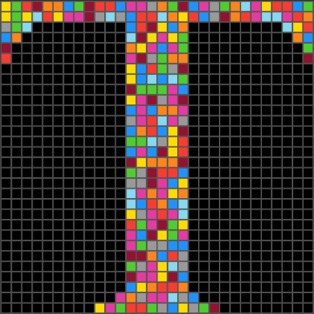

<p align="center">
  
</p>

# Tessera-ARC

> **Capturing Human Reasoning on Abstract Visual Puzzles**

[](https://www.tessera-arc.org)
[](https://opensource.org/licenses/MIT)

A crowdsourcing platform that collects rich human cognitive data on [ARC (Abstraction and Reasoning Corpus)](https://github.com/fchollet/ARC-AGI) tasks. We capture not just solutions, but the complete reasoning process—from first impressions to final strategies.
---
---
> **⚠️ Note:** Platform is live and collecting data. Dataset will be released open-source once we reach 1,000+ task attempts.
---
## 🎯 Why This Matters

The ARC benchmark measures general fluid intelligence in AI systems. Current state-of-the-art AI achieves ~55% accuracy, while humans reach 76%+ with minimal examples. **The gap is human reasoning.**

Tessera-ARC bridges this gap by collecting:
- 🧠 **Hierarchical perception data** (7 categories, 35 subcategories)
- 📝 **Natural language reasoning** (500-800 words per task)
- 🖱️ **Complete behavioral traces** (every click, resize, reset)
- ⏱️ **Temporal dynamics** (millisecond-level timing)
- 🎯 **Metacognitive insights** (confidence, difficulty, strategy)

**Goal:** Build an open-source dataset to train more human-like AI reasoning systems.

---

## ✨ Key Features

**For Participants:**
- Interactive grid editor with ARC's 10-color palette
- 800 official V1 ARC tasks AND 1120 V2 tasks (total 1147 due to V1 tasks reused in V2) from training + evaluation sets
- Progressive 4-phase questionnaire that reduces cognitive load
- Real-time solution validation with visual feedback

**For Researchers:**
- Complete PostgreSQL schema with 5 normalized tables
- Hierarchical perceptual taxonomy based on cognitive science
- Full behavioral logging (cell clicks, tool usage, temporal sequences)
- Export to JSON/CSV for analysis

---

## 🚀 Quick Start

### Prerequisites
- Node.js v18+
- PostgreSQL v18+
- npm

### Installation
```bash
# Clone and install
git clone https://github.com/laurent-cheret/tessera-arc.git
cd tessera-arc
npm run install:all

# Configure database
cd server
cp .env.example .env
# Edit .env with your PostgreSQL credentials

# Initialize database
npm run db:setup
npm run db:populate

# Start development
cd ..
npm run dev
```

**Access:**
- Frontend: http://localhost:3000
- Backend API: http://localhost:5000

---

## 📊 What We Collect

### Phase 1: First Impressions (Pre-Solving)
- Hierarchical visual observations (primary + secondary features)
- Initial pattern hypothesis (10-100 words)
- Confidence level (1-5 scale)

### Phase 2: Solving Process (Automatic)
- Every cell modification (coordinates, colors, timestamps)
- Grid operations (resize, reset, copy)
- Complete action sequence with millisecond precision

### Phase 3: Reflection (Post-Solving)
- What you tried and why (15-500 words)
- Hypothesis revisions
- Problem-solving strategy used

### Phase 4: Metacognition
- Difficulty rating (1-5 scale)
- Challenge factors (visual complexity, pattern ambiguity, etc.)

**Per task:** 500-800 words + 10-50 actions + metadata

---

## 🗄️ Database Schema
Full schema: [database_schema_fixed.sql](server/database_schema_fixed.sql)

---

## 🛠️ Tech Stack

**Frontend:** React, Tailwind CSS  
**Backend:** Node.js, Express  
**Database:** PostgreSQL  
**Security:** Cloudflare Turnstile, rate limiting  
**Deployment:** Railway (backend), custom domain

---

## 📖 Research Context

**Key Papers:**
- Chollet, F. (2019). "On the Measure of Intelligence." [Paper](https://arxiv.org/abs/1911.01547)
- [ARC Prize 2024](https://arcprize.org/) - Current SOTA: 55.5% (Anthropic)

**ARC Dataset:**
- [ARC-AGI Repository](https://github.com/fchollet/ARC-AGI) - 800 training tasks, 400 evaluation tasks

**If you use this dataset:**
```bibtex
@software{tessera_arc_2025,
  author = {Laurent Cheret},
  title = {Tessera-ARC: A Dataset of Human Reasoning on Abstract Visual Tasks},
  year = {2025},
  url = {https://github.com/laurent-cheret/tessera-arc},
  note = {Live demo: https://www.tessera-arc.org}
}

@article{chollet2019measure,
  title={On the Measure of Intelligence},
  author={Chollet, Fran{\c{c}}ois},
  journal={arXiv preprint arXiv:1911.01547},
  year={2019},
  url={https://arxiv.org/abs/1911.01547}
}
```

---

## 🤝 Contributing

Contributions welcome! Open an issue or submit a PR.

**Priority areas:**
- Mobile responsiveness improvements
- Additional analysis tools
- Data visualization dashboards
- Multi-language support

---

## 📧 Contact
**Email:** tesseraarc@gmail.com
**GitHub:** [@laurent-cheret](https://github.com/laurent-cheret)  
**Live Platform:** [www.tessera-arc.org](https://www.tessera-arc.org)

---

## 📄 License

MIT License - see [LICENSE](LICENSE) for details.

---

**⭐ Star this repo to support open research in AI reasoning!**
